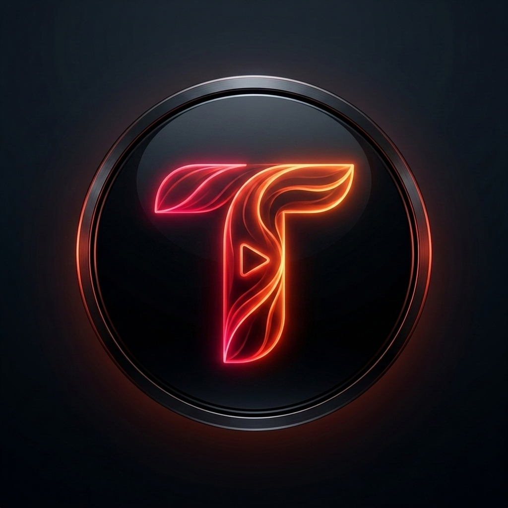

<div align="center">
  
  <h1>Tuben - Reklamsız Video & Müzik Deneyimi</h1>
  <p>
    <strong>Gizlilik odaklı, sıfır reklam, arka planda oynatma ve lüks AMOLED arayüze sahip yeni nesil YouTube istemcisi.</strong>
  </p>

  <p>
    
    
    
    
    
  </p>
</div>

---

## 🌟 Öne Çıkan Özellikler

### 🛡️ 1. Reklamsız ve Kesintisiz Akış
- **Sıfır Video Reklamı:** Video öncesi, sırası ve sonrasındaki tüm ticari reklamlar tamamen filtrelenir.
- **SponsorBlock Entegrasyonu:** Videolardaki sponsor bölümleri, introlar, outro'lar ve kanal tanıtımları akıllı algoritmalarla otomatik olarak tespit edilip atlanır.

### ⚡ 2. Güçlü Oynatıcı & DASH Akış Motoru
- **Senkronize DASH / Muxed Akış:** YouTube'un ayrı ilettiği yüksek kaliteli video ve ses akışları dinamik ISO BMFF `.mpd` manifestleri ile ExoPlayer (`expo-video`) üzerinde milisaniyelik senkronla oynatılır.
- **Çoklu Kalite Seçenekleri:** 1080p Full HD, 720p, 480p, 360p ve Otomatik kalite adaptasyonu.
- **Oynatma Hızı Kontrolü:** 0.5x'ten 2.0x'e kadar hız ayarları.
- **Jest Tabanlı Kontroller:** Çift dokunuşla 10 saniye ileri/geri sarma, akıcı scrubbing ve sezgisel kontroller.

### 🎧 3. Arka Planda Çalma & PiP (Resim İçinde Resim)
- **Ekran Kapalıyken Çalma:** Ekranınızı kilitleseniz veya başka uygulamalara geçseniz dahi podcast ve müzik dinlemeye devam edin.
- **Picture-in-Picture (PiP):** Cihazınızda gezinirken küçük boyutlu bir pencere ile videoyu izlemeye devam edin.
- **Sürüklenebilir MiniPlayer:** Uygulama içinde gezinirken videoyu küçülterek altta tutun, yukarı kaydırarak genişletin veya yana kaydırarak kapatın.

### 📥 4. Çevrimdışı İndirme Yöneticisi (Offline Download)
- **Cihaza Kaydetme:** Videoları ve müzikleri doğrudan cihaz hafızasına yüksek hızda indirin.
- **İnternetsiz Oynatma:** İndirilen içeriklere `Kitaplık > İndirilenler` bölümünden tek tıkla internet bağlantısı gerekmeden anında erişin.

### 🌙 5. Saf Siyah AMOLED Modu & Lüks Tasarım
- **Gerçek `#000000` AMOLED Teması:** OLED/AMOLED panellerde pikselleri tamamen kapatarak maksimum pil tasarrufu sağlar ve gece kullanımında göz konforu sunar.
- **Modern Cam Efektleri & Tipografi:** YouTube Red & Cyberpunk estetiğinde özel tasarım öğeleri.

### ⏱️ 6. Akıllı Uyku Zamanlayıcısı (Sleep Timer)
- Gece dinlemeleri için oynatıcı üzerinden 15, 30, 45 veya 60 dakikalık zamanlayıcı kurun; süre dolduğunda oynatma otomatik olarak dursun.

### 🔍 7. Zengin İçerik & Sosyal Özellikler
- **Kategori Beslemeleri:** Tümü, Trendler, Müzik, Oyun, Haberler, Teknoloji kategorilerinde anlık popüler içerikler.
- **Anlık Arama & Öneriler:** Harf girdikçe otomatik tamamlanan arama önerileri ve zengin sonuçlar.
- **Kanal Sayfaları:** Kanal avatarı, abone sayısı, yüklenen videolar ve kanal sekmesi.
- **Yorumlar:** YouTube yorumlarını ve beğeni sayılarını görüntüleme.
- **Kitaplık & Bulut Senkronizasyonu:** İzleme Geçmişi, Beğenilen Videolar ve Kişisel Oynatma Listeleri Firebase ile senkronize edilir.

---

## 🏗️ Proje Mimarisi

```
tuben/
├── assets/                    # Uygulama simgeleri, splash ekranı ve görseller
├── android/                   # Android yerel yapılandırması (Kotlin, CMake, ExoPlayer, Gradle)
├── src/
│   ├── auth/                  # Firebase Kimlik Doğrulama (AuthContext)
│   ├── components/            # Yeniden kullanılabilir UI bileşenleri
│   │   ├── MiniPlayer.tsx     # Altta yüzen mini oynatıcı
│   │   ├── PlayerView.tsx     # Tam ekran video oynatıcı (Hız, Kalite, Uyku)
│   │   ├── VideoCard.tsx      # Video kartı ve meta bilgileri
│   │   └── ...
│   ├── constants/             # Renk paleti, tipografi ve tema sabitleri
│   ├── navigation/            # React Navigation Stack & Bottom Tab yapılandırması
│   ├── repositories/          # Veri katmanı (Firebase & AsyncStorage)
│   ├── screens/               # Ana ekranlar
│   │   ├── HomeScreen.tsx     # Ana sayfa ve kategori akışları
│   │   ├── TrendingScreen.tsx # Popüler & trend videolar
│   │   ├── SearchScreen.tsx   # Arama ve arama önerileri
│   │   ├── PlayerScreen.tsx   # Video detay, yorumlar ve önerilenler
│   │   ├── ChannelScreen.tsx  # Kanal profili ve videoları
│   │   ├── LibraryScreen.tsx  # Kitaplık, Geçmiş, İndirilenler ve Listeler
│   │   └── SettingsScreen.tsx # Reklam engelleme, AMOLED ve kalite ayarları
│   ├── services/              # Dış servis entegrasyonları
│   │   ├── youtubeService.ts  # InnerTube API motoru & DASH Manifest üretici
│   │   ├── sponsorBlockService.ts # SponsorBlock REST API istemcisi
│   │   ├── downloadService.ts # expo-file-system tabanlı indirme yöneticisi
│   │   └── nativePlayerBridge.ts # Arka plan oynatımı ve PiP köprüsü
│   ├── store/                 # Zustand durum yöneticileri
│   │   ├── usePlayerStore.ts  # Oynatıcı durumu, sıra, kalite ve zaman takibi
│   │   ├── useLibraryStore.ts # Beğeniler, geçmiş ve oynatma listeleri
│   │   └── useThemeStore.ts   # Dinamik AMOLED / Dark tema yönetimi
│   └── types/                 # TypeScript veri modelleri ve arayüzler
├── app.json                   # Expo uygulama meta verileri
├── package.json               # Bağımlılıklar ve npm betikleri
└── tsconfig.json              # TypeScript derleme kuralları
```

---

## 🚀 Başlangıç ve Kurulum

### Ön Koşullar
- **Node.js**: v18+ veya v20+
- **Java JDK**: Eclipse Temurin 17+
- **Android SDK**: Build Tools 36.0.0, NDK 27.1+

### 1. Bağımlılıkları Yükleyin
```bash
git clone <repo-url>
cd tuben
npm install
```

### 2. TypeScript Kontrolü
```bash
npx tsc --noEmit
```

### 3. Geliştirme Sunucusunu Başlatma
```bash
npx expo start
```

### 4. Android Release APK Derleme
Android klasörüne geçerek yerel Gradle aracıyla release APK'sını oluşturabilirsiniz:
```bash
cd android
.\gradlew.bat assembleRelease --no-daemon
```
Derlenen APK dosyası şu konumda yer alır:
`android/app/build/outputs/apk/release/app-release.apk`

### 5. Cihaza Yükleme (ADB)
Telefonunuz USB ile bağlı ve USB Hata Ayıklama aktif durumdayken:
```bash
adb install -r android/app/build/outputs/apk/release/app-release.apk
```

---

## 🛠️ Kullanılan Teknolojiler

| Teknoloji | Sürüm / Açıklama |
| :--- | :--- |
| **React Native** | `0.86.3` (Modern mimari) |
| **Expo** | `~57.0.21` SDK |
| **expo-video** | `~57.0.3` (ExoPlayer tabanlı yüksek performanslı oynatıcı) |
| **Zustand** | `^5.0.15` (Reaktif, optimize edilmiş state yönetimi) |
| **Firebase** | `^12.19.0` (Kimlik doğrulama & Firestore / Realtime DB) |
| **expo-file-system** | `~57.0.6` (Çevrimdışı depolama) |
| **Shopify FlashList**| `2.0.2` (60 FPS pürüzsüz liste kaydırma) |
| **React Navigation** | `v7` (Stack ve Bottom Tabs) |
| **SponsorBlock** | REST API Entegrasyonu |

---

## 🔒 Güvenlik & Gizlilik
- **Google Hesabı Zorunluluğu Yoktur:** Google hesap bilgilerinizi YouTube ile paylaşmadan tamamen anonim olarak video izleyebilirsiniz.
- **Kişisel Veri Takipsizliği:** İzleme alışkanlıklarınız üçüncü taraf reklam ağlarıyla asla paylaşılmaz.
- **Doğrudan İstemci-Sunucu İletişimi:** Video ve arama istekleri doğrudan cihazınızdan resmi YouTube uç noktalarına şifreli (HTTPS) olarak iletilir.

---

## 📄 Lisans
Bu proje kişisel kullanım ve eğitim amaçlı geliştirilmiştir. Tüm telif hakları ilgili medya sahiplerine aittir.
